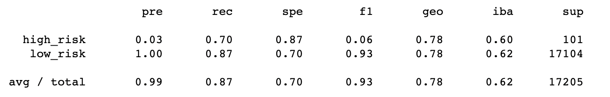

# Credit_Risk_Analysis
## Overview of the analysis

### Purpose:
The purpose of this analysis was to train and evaluate the data, using different techniques to to evaluate and predict credit risk for loans. Additionally, each technique used toperfomr the nalaysis was evaluated to determine the most effective and accurate technique to determine credit risk. 

## Results
Below is a list of all six methods used, along with their balanced accuracy scores, precision and recall scores:

- RandomOverSampler
Acuracy: 0.65
Average Precision: 0.99
Average Recall: 0.60

 

- SMOTE
Acuracy: 0.63
Average Precision: 0.99
Average Recall: 0.67

 

- ClusterCentroids
Acuracy: 0.54
Average Precision: 0.99
Average Recall: 0.41

 

- SMOTEENN
Acuracy: 0.65
Average Precision: 0.99
Average Recall: 0.55

 

- BalancedRandomForestClassifier
Acuracy: 0.50
Average Precision: 0.99
Average Recall: 0.87

 

- EasyEnsembleClassifier
Acuracy: 0.61
Average Precision: 0.99
Average Recall: 1.00

 

## Summary: 
### Summary of the results

Acuracy refers to the method's ability to correctly classify risk either high or low. None of the methods used performed particularly well in this area ranging from .50 to .65. This means that they classified some loans as low risk when they were high risk or vice versa, some loans were classified as high risk were they were low risk. 

Precision refers to identifying true positives from false positives, or the program's ability to identify the ones we want to identify (such as low risk loans so that the loans can be granted). When we look at the average precision for the programs, they all appear to be at .99 which is significantly high. However, when looking more closely at these values, it appears that most of the methods only performed well in identifying low risk loans. The EasyEnsembleClassifier performed at .77 for high risk loans a 1.00 for low risk loans. 

We also used recall to evaluate the method's sensitivity or the ability to identify true positives from the false negatives. BalancedRandomForestClassifier performed overall better in the area of recall with .70 for high risk and .87 for low risk.

Based on these results, none of the methods performed well in all areas. Due to the nature of the data, it is recommended to focus on precision and not on recall. This will ensure that most loans granted will be low risk with the caveat that some high risk loans will be approved and some low risk loans will be denied, but most of the loans granted will be low risk. In terms of precision, EasyEnsembleClassifier outperformed the other methods and is therfore recomnded for further use in assess risk. 
